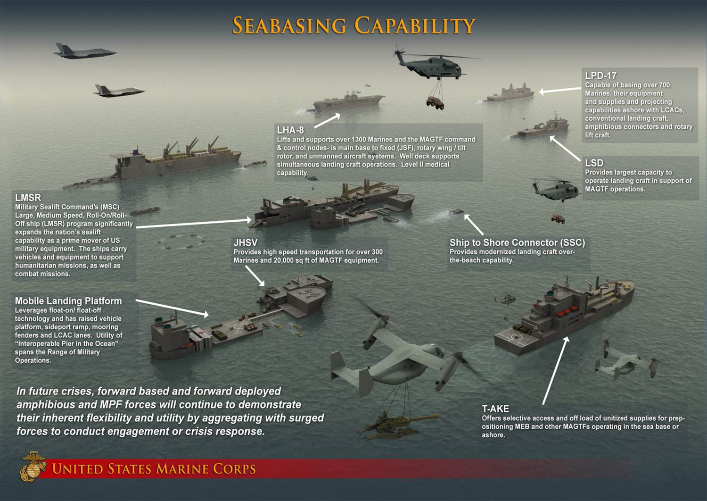

# 关于本书

##基于macOS环境的开发武器库指南：快速武装方法

macOS Based Dev Arsenal Guide: A Quick Gear Up 

macOS所属企业的商业惯性使得他无法利用好自己已经为Linux/Unix 社区做好的工作，来讲如何用macOS做好开发环境；因为这些知识和工具大部分不属于macOS系统；
而macOS上各家各户分散的工具属性的碎片化状态，也不可能产生一个Union形成合力将他们很好的归纳总结。搜索引擎的发达，使得软件工程师更多的依赖于现场的google/baidu的结果，而搜索引擎推荐结果的可靠程度也就决定了是否能够在遇到问题的时候能否甄别正确有效可靠的解决方法。

美军为了提高动员速度，提出了海上预置武器库的概念：

"在未来的危机中，前进基地和前置部署的水路两栖，海上预置部队将持续表现出它的弹性和机动性，
通过与精确打击部队配合介入战斗和危机响应。 "

[ img01 | https://www.mccdc.marines.mil/Units/Seabasing/What-Is-Seabasing/Seabasing-Capability/]
图像来自美国海军陆战队战斗力拓展司令部，关于海上拓展基地（预补给基地）MCCDC

本书正致力于提供这样一个预置的武器库，在遇到特定领域的问题的时候，基础的工具和做法已经成为了预置在手中的武器库，能够快速响应问题，进入实质性解决问题的状态，而不是在环境/方法/工具上耗费时间。

本书写作的目的在于，归纳整理基本的能够快速学习，进入使用状态的碎片化知识，提供一个entrance level 的最佳实践合集，同时提供迈向更高一级使用水准的引子。

Reinhard , 2018-09

> 本书遵循MIT发行协议，在使用时敬请尽量注明原始出处。
> 《macOS devworks enhanced  | macOS 开发环境提升指南 》macinaction.stusci.com
